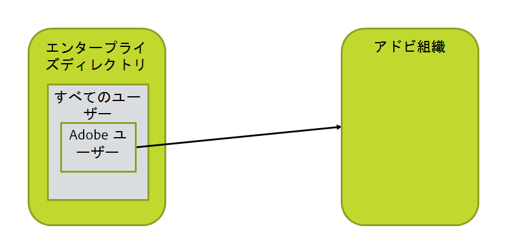
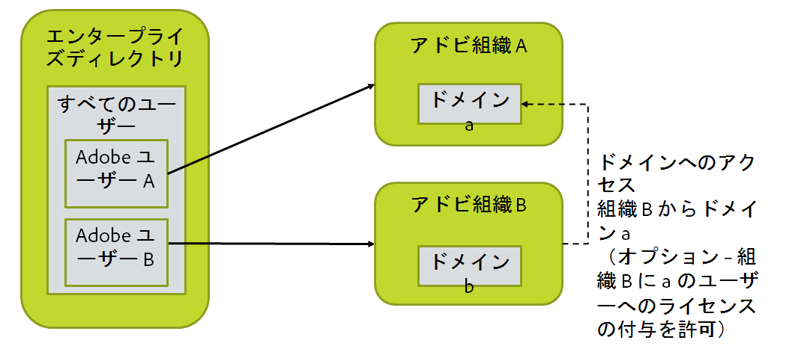
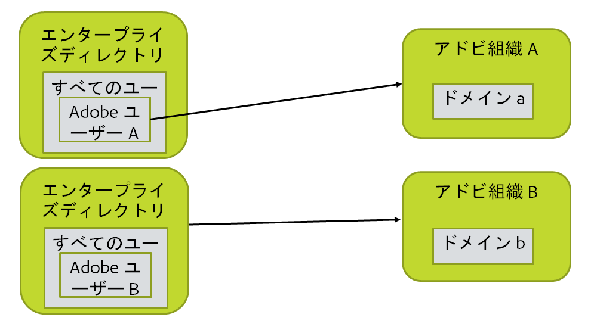
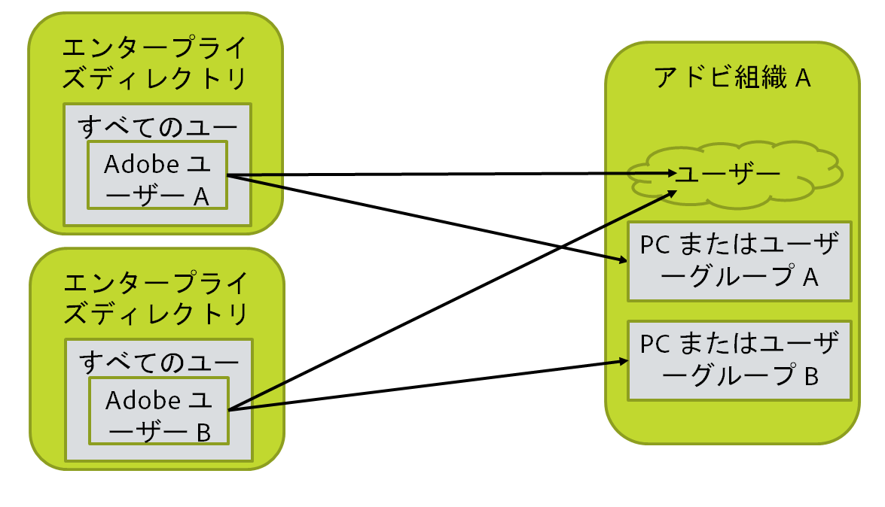

# 組織、グループ、ディレクトリのレイアウト

[前の節](before_you_start.md) \| [目次に戻る](index.md) \| [次の節](layout_products.md)

この手順では、ディレクトリ、アドビ組織、ユーザー構成の図を作成する必要があります。これに LDAP クエリを含める必要がありますが、これはユーザーと、ユーザーがベースとするドメインのリストを選択するためです（ユーザーの電子メールアドレスが n@d.com であれば、ドメインは d.com です）。

&#9744; この節では代替の構成をいくつか示しています。そのうち 1 つのみに対応する手順を実行してください。

## 最も単純で一般的なケース

ほとんどの構成はこのようになります。1 つのディレクトリと 1 つのアドビ組織があります。すべてのユーザーをアドビに含めるユーザーとして選択することも、サブセット（特定のディレクトリグループのメンバーなど）のみを選択することもできます。自らの組織のためにどのようにセットアップするかを決定し、適切なユーザーを選択する LDAP クエリを作成する必要があります。

&#9744; アドビと同期させるユーザーのセットを選択する LDAP クエリが必要です。これは、後の手順で User Sync 構成ファイルの 1 つに含めます。

&#9744; Adobe Admin Console で、アドビ組織で管理する各ドメインを要求する必要があります。

&#9744; ディレクトリにアクセスするために必要な認証情報を収集します。読み取り専用のディレクトリアクセスアカウントを作成し、それを使用して AD、LDAP または他のディレクトリシステムにアクセスすることをお勧めします。

## 複数のアドビ組織

組織ごとに 1 つずつ、2 つの同期インスタンスを実行する必要があります。この場合、基本的には、異なるファイルディレクトリでのインストールごとに User Sync を 2 回インストールすることになります。

一方の組織のライセンスが他方の組織のユーザーによって使用される予定がある場合、セットアップは複雑になります。ライセンスがユーザーに割り当てられる各組織について、アドビ組織のアクセス認証を取得する必要があります。

次が必要になります。

- &#9744; 各アドビ組織への管理アクセス

- &#9744; 各ユーザーセットのための LDAP クエリ

-  後の手順で複数の User Sync インストールをセットアップするために準備します。

-  &#9744; ディレクトリにアクセスするために必要な認証情報を収集します。読み取り専用のディレクトリアクセスアカウントを作成し、それを使用して AD、LDAP または他のディレクトリシステムにアクセスすることをお勧めします。

## 複数のディレクトリと複数の組織

基本的には、すべてを含むインスタンスが 2 つ存在します。ディレクトリと組織ごとに 1 回ずつ、同期構成を 2 回実行する必要が生じます。

一方の組織のライセンスが他方の組織のユーザーによって使用される予定がある場合、セットアップは複雑になります。

次が必要になります。

- &#9744; 各アドビ組織への管理アクセス

- &#9744; 各ユーザーセットのための LDAP クエリ

-  後の手順で複数の User Sync インストールをセットアップするために準備します。

-  &#9744; ディレクトリにアクセスするために必要な認証情報を収集します。読み取り専用のディレクトリアクセスアカウントを作成し、それを使用して AD、LDAP または他のディレクトリシステムにアクセスすることをお勧めします。
 各ディレクトリインスタンスへのアクセスに必要な認証情報が異なる場合があるため注意してください。

## 複数のディレクトリと 1 つの組織

ディレクトリごとに 1 回ずつ、2 回の同期構成を実行する必要があります。

2 つの User Sync ジョブでマップおよび管理されるユーザーグループ（UG）と製品プロファイル(PP)が重なってはなりません。つまり、各ユーザーグループと PP は 1 つの User Sync インスタンスのみで管理されます。

このように構成されている場合、User Sync を使用してユーザーを削除することができません。2 つの同期インスタンスが互いにユーザーを削除しようとするためです。

次が必要になります。

- &#9744; アドビ組織への管理アクセス

- &#9744; 各ユーザーセットのための LDAP クエリ

-  後の手順で複数の User Sync インストールをセットアップするために準備します。

-  &#9744; ディレクトリにアクセスするために必要な認証情報を収集します。読み取り専用のディレクトリアクセスアカウントを作成し、それを使用して AD、LDAP または他のディレクトリシステムにアクセスすることをお勧めします。
 各ディレクトリインスタンスへのアクセスに必要な認証情報が異なる場合があるため注意してください。

[前の節](before_you_start.md) \| [目次に戻る](index.md) \| [次の節](layout_products.md)
