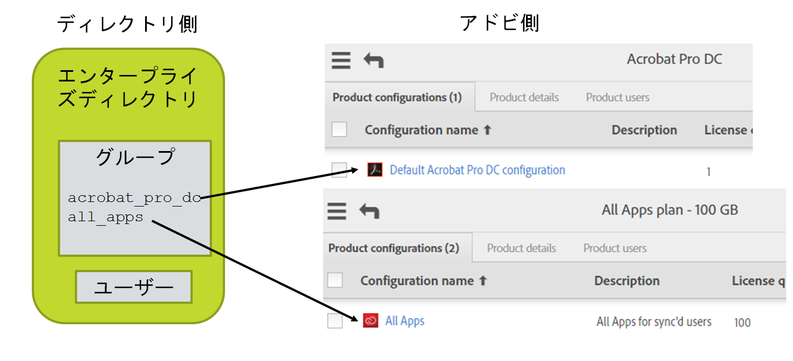

# アドビ製品、製品プロファイル、ユーザーグループのレイアウト

[前の節](layout_orgs.md) \| [目次に戻る](index.md) \| [次の節](decide_deletion_policy.md)

製品プロファイル (PP)は、アドビのユーザー管理システムにおけるグループのような構造です。各 PP は購入した製品に関連付けられます。PP に追加されたユーザーは、対応する製品へのアクセスが付与され、その製品を使用するライセンスを取得します（ユーザーはこのプロセスでは何も受け取りませんが、アクセスが許可されたという通知をオプションで設定することはできます。すべてのライセンス管理はバックエンドシステムによって処理されます）。

PC を作成するときに（Adobe Admin Console を使用して作成）、カスタムオプションを追加して、ユーザーが特定のアドビ製品を使用する方法を制御できます。

ユーザーを PP に直接追加して、製品へのアクセスを許可することができます。これはアドビ製品ライセンスを管理する最も一般的な方法です。

アドビユーザーグループを使用すると、ユーザーの編成を認識しているとおりに論理的にグループ分けできます。ユーザーグループの使用はオプションです。ユーザーグループを PP に追加して、そのユーザーにライセンスを付与することができます。ユーザーをユーザーグループに追加しても、ユーザーグループを PC に追加してそのメンバーが PP のメンバーに暗黙的にならない限り、ライセンスは付与されません。

ユーザーグループと PP は 1 つの User Sync インスタンスでしか管理できません。複数のディレクトリまたは分散した部署が存在し、そのユーザー情報を User Sync 経由でアドビに送っている場合、それぞれは 1 つのユーザーグループまたは PP と一致する必要があります。そうでない場合、User Sync は、削除すべきユーザーや別の User Sync の別のインスタンスによって追加されたユーザーを区別できません。

User Sync を使用して PP のメンバーシップとライセンス割り当てを管理できます。ただし、これはオプションです。この管理は、Adobe Admin Console で手動で実行するか、他のアプリケーションからもおこなえます。

User Sync では、ディレクトリシステムインターフェイスまたは他のツールを使用して、ユーザーをディレクトリグループに分けることができるため、アドビ製品のライセンスの管理に役立ちます。これらのグループは後でアドビユーザーグループまたは PP にマップされます。マッピングは User Sync 構成ファイルに含まれます。User Sync によって、マッピングされたグループの 1 つにディレクトリユーザーが含まれることが検出されると、そのユーザーは対応するアドビユーザーグループまたは PP に追加されます。同様に、ユーザーグループまたは PP 内のユーザーが、対応するディレクトリグループに含まれない場合は、ユーザーグループまたは PP から削除されます。

&#9744; User Sync を使用してライセンス割り当てを管理するかどうかを決定します。使用しない場合、残りの手順は省略できます。ただし、作成したユーザーがアドビ製品にアクセスできるようにするには、前もって Adobe Admin Console を使用して、それらのユーザーを製品プロファイルに手動で追加する必要があります。

&#9744; 管理する製品プロファイルとユーザーグループのために、Adobe Admin Console で PP を作成します。PP の説明フィールドに「Managed by User Sync - do not edit」（User Sync によって管理 - 編集不可）というコメントを付けます。

&#9744; ユーザーグループを使用して製品のアクセスを管理する場合は、まずユーザーグループと製品構成を作成する必要があります。その後、各ユーザーグループを適切な製品構成に追加することにより、製品のアクセスを管理できます。ユーザーグループの説明フィールドに「Managed by User Sync - do not edit」（User Sync によって管理 - 編集不可）というコメントを付けます。

&#9744; アドビ組織および各アドビ組織内の製品と PP の図を作成します。その図にディレクトリとディレクトリグループを追加し、マッピングを示します。以下に例を挙げます。

[前の節](layout_orgs.md) \| [目次に戻る](index.md) \| [次の節](decide_deletion_policy.md)

