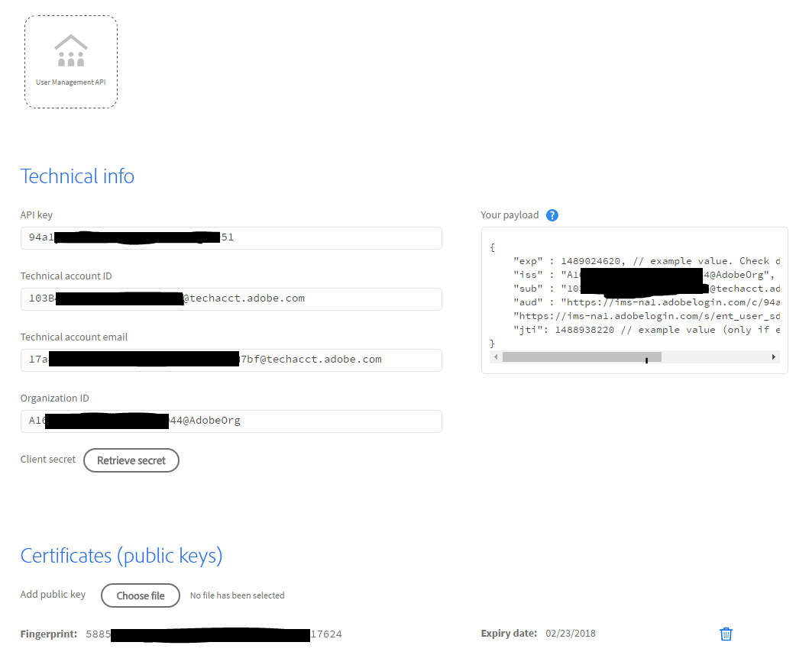

# Adobe.io 統合のセットアップ

[前の節](decide_deletion_policy.md) \| [目次に戻る](index.md) \| [次の節](identify_server.md)

アドビによってアプリケーションが Adobe API と統合するための安全なプロトコルが設計されました。User Sync はそのようなアプリケーションの 1 つです。

セットアップ手順を説明します。統合のセットアッププロセスの詳細や証明書の要件については、[ここ](https://www.adobe.io/apis/cloudplatform/console/authentication.html)を参照してください。

- 最初の API 呼び出しに署名するデジタル証明書を作成または取得する必要があります。
  - この証明書は SSL または他の目的では使用されないため、信頼チェーンやブラウザーの問題は該当しません。
  - 証明書は無償または有償のツールを使用して自分で作成できます（または社内の IT 部署から取得できます）。
  - 公開キー証明書ファイルと秘密キーファイルが必要になります。
  - 秘密キーファイルはルートパスワードと同様に保護することをお勧めします。
- いったんセットアップすると、必要なすべての値が Adobe.io コンソールに表示されます。これらを User Sync の構成設定ファイルにコピーします。
- 秘密キーファイルも User Sync 構成に追加する必要があります。

&#9744; デジタル署名の証明書を取得するか作成します。[証明書作成の手順](https://www.adobe.io/apis/cloudplatform/console/authentication/createcert.html)を参照してください。

&#9744; [Adobe I/O コンソール](https://console.adobe.io) を使用して、新規または既存の adobe.io 統合にユーザー管理を追加します。アクセスする必要のある各組織 に対しておこないます（通常は 1 組織のみ）。

&#9744; 統合の構成パラメーターを書き留めておきます（一部を隠した例を次に示します）。これは後の手順で使用します。

[前の節](decide_deletion_policy.md) \| [目次に戻る](index.md) \| [次の節](identify_server.md)
