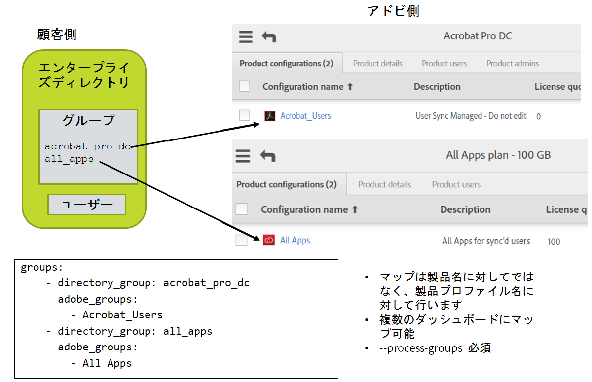

# 詳細な構成

## このセクションの内容
{:."no_toc"}

* TOC Placeholder
{:toc}

---

[前のセクション](usage_scenarios.md)  \| [次のセクション](deployment_best_practices.md)

---

User Sync では、データの構造がより複雑な環境でユーザーデータを同期する場合は追加の構成が必要です。

- スプレッドシートまたはエンタープライズディレクトリから Adobe ID ユーザーを管理する場合、それらのユーザーを無視しないようにツールを構成できます。
- ユーザーの企業に複数のアドビ組織が含まれる場合、自分の組織のユーザーを他の組織で定義されたグループに追加するようツールを構成することができます。
- エンタープライズユーザーデータにカスタマイズされた属性とマッピングが含まれる場合、それらのカスタマイズを認識するにはツールを構成する必要があります。
- 電子メールではなくユーザー名をベースにしたログインを使用する場合。
- User Sync に加えて、Adobe Admin Console によって一部のユーザーアカウントを手動で管理したい場合

## Adobe ID によるユーザーの管理

構成オプション `exclude_identity_types`（メインの構成ファイルの `adobe_users` セクション内）では、デフォルトで Adobe ID ユーザーを無視するよう設定されています。User Sync で一部の Adobe ID タイプユーザーを管理する場合、`exclude_identity_types` で `adobeID` エントリを取り除くことにより、構成ファイルでこのオプションをオフにする必要があります。

エンタープライズディレクトリからの入力ではなく場合によっては CSV 入力を使用することで、それらのユーザー専用に個別の同期ジョブをセットアップするのがよいでしょう。これをおこなう場合、この同期ジョブが Enterprise ID および Federated ID のユーザーを無視するように構成しないと、ユーザーは恐らくディレクトリから取り除かれるでしょう。

次の場合には、User Sync によって Adobe ID ユーザーを取り除いても希望する効果が得られない可能性があります。

* 組織から adobeID ユーザーを取り除くよう指定した場合、いつか再び追加するには、
再度招待する（そしてユーザーも再度同意する）必要があります。
* システム管理者はよく Adobe ID を使用するので、Adobe ID ユーザーを取り除くと、システム管理者（自分も含めて）を誤って取り除いてしまう場合があります。

Adobe ID ユーザーを管理するためのより良い方法は、それらを追加してそのグループメンバーシップを管理し、決して取り除かないことです。グループメンバーシップを管理することにより、エンタイトルメントを無効にでき、いつかそれらを再び有効にする場合でも新しい招待を発行する必要がありません。

Adobe ID アカウントはエンドユーザーが所有し、削除できません。削除アクションを適用すると、User Sync は自動的に削除アクションを取り除くアクションに置き換えます。

また、他の除外構成アイテムを使用することで、User Sync が特定の Adobe ID を取り除くのを防げます。詳しくは、「[特定のアカウントを User Sync の削除から保護する](#特定のアカウントを-user-sync-の削除から保護する)」を参照してください。

## 他の組織のユーザーへのアクセス

大企業には、複数のアドビ組織が含まれる場合があります。例えば、Geometrixx という企業には複数の部署があり、各部署には独自の固有の組織 ID と独自の Admin Console があるとします。

組織が Enterprise または Federated ユーザー ID を使用する場合、ドメインをクレームする必要があります。小規模の企業では、1 つの組織がドメイン **geometrixx.com** をクレームします。ただし、ドメインをクレームできるのは 1 つの組織のみです。同じ企業に複数の組織が所属する場合、一部またはすべての組織で企業ドメインに属するユーザーを含めるのがよいでしょう。

この場合、各部署のシステム管理者は、ID に使用するためにこのドメインをクレームする必要があります。Adobe Admin Console では、複数の部署が同じドメインをクレームすることはできません。ただし、1 つの部署でクレームされると、他の部署も別の部署のドメインへのアクセスを要求することができます。最初にドメインをクレームする部署は、そのドメインの*所有者*となります。その部署は、他の部署からのアクセスの要求を承認する責任があり、他の部署は特別な構成要件なしでドメイン内のユーザーにアクセスできるようになります。

アクセスを付与されたドメインのユーザーにアクセスするために特別な構成は必要ありません。ただし、他の組織で定義されているユーザーグループや製品構成にユーザーを追加する場合は、それらの組織にアクセスできるよう User Sync を構成する必要があります。ツールでは、グループを定義した組織の資格情報を見つける必要があり、外部の組織に属するグループであることを識別できる必要があります。


## 他の組織のグループへのアクセス

他の組織のグループへのアクセスを構成するには、次をおこなう必要があります。

- 追加の umapi 接続構成ファイルを含める。
- これらのファイルへのアクセス方法を User Sync に伝える。
- 別の組織で定義されているグループを識別する。

### 1.追加の構成ファイルを含める

アクセスが必要な組織ごとに、その組織に対するアクセスの資格情報を提供する構成ファイルを追加する必要があります。ファイルは、connector-umapi.yml ファイルと同じ形式です。追加の各組織は、お客様が定義する短い名称で参照されます。その組織に対するアクセスの資格情報を持つ構成ファイルの名前は、任意に指定することができます。

例えば、別の組織が「department 37」という名前だとします。その構成ファイルの名前は次のようにすることもできます。

`department37-config.yml`

### 2.追加のファイルにアクセスするよう User Sync を構成する


メインの構成ファイルの `adobe-users` セクションには、それらのファイルを参照するエントリを含める必要があり、それぞれを組織の短い名称と関連付ける必要があります。以下に例を挙げます。

```YAML
adobe-users:
  connectors:
    umapi:
      - connector-umapi.yml
      - org1: org1-config.yml
      - org2: org2-config.yml
      - d37: department37-config.yml  # d37 は上記の例の短い名称
```

対象外のファイル名が使用されている場合、それらを参照するメインの構成ファイルと同じフォルダー内に構成ファイルを配置する必要があります。

なお、ユーザー独自の接続構成ファイルと同様に機密情報が含まれるため保護する必要があります。

### 3.外部で定義されたグループを識別する

グループマッピングを指定する場合、エンタープライズディレクトリグループをアドビユーザーグループまたは別の組織で定義された製品構成にマッピングできます。

これをおこなうには、グループ名に組織の識別子をプレフィックスとして使用します。それらを「::」で結合します。以下に例を挙げます。

```YAML
- directory_group: CCE Trustee Group
  adobe_groups:
    - "org1::Default Adobe Enterprise Support Program configuration"
    - "d37::Special Ops Group"
```

## カスタム属性とマッピング

ユーザーの定義とアップデートに使用するフィールド（名、姓、メールアドレス、ユーザー名、国、およびグループメンバーシップ）に、ディレクトリ属性またはその他の値のカスタムマッピングを定義することができます。通常は、ディレクトリの標準属性を使ってこれらの値を取得します。使用する他の属性を定義して、フィールド値の計算方法を指定することができます。

これをおこなうには、エンタープライズディレクトリのユーザーデータとアドビのユーザーデータとの間の非標準マッピングを認識するよう User Sync を構成する必要があります。非標準のマッピングには次が含まれます。

- ディレクトリ内の非標準属性にある、またはそれに基づいた、ユーザー名、グループ、国、または電子メールの値。
- ディレクトリの情報から計算する必要があるユーザー名、グループ、国、または電子メールの値。
- 一部またはすべてのユーザーについてリストで追加または取り除く必要のある他のユーザーグループや製品。

ご使用の構成ファイルは、ディレクトリから取得するすべてのカスタム属性を指定する必要があります。さらに、それらの属性の任意のカスタムマッピング、および値を同期するために実行する計算またはアクションを指定する必要があります。カスタム アクションは、Python コードの小さなブロックを使用して指定します。サンプルと標準的なブロックが提供されています。

カスタム属性とマッピングの構成は、別の構成ファイルに配置します。そのファイルは、`directory_users` セクションにあるメインの構成ファイルから参照されます。

```
directory_users:
  extension: extenstions_config.yml  # カスタムマッピング情報を含むファイルへの参照
```

カスタム属性の処理はユーザーごとにおこなわれるため、カスタマイズはメインの User Sync 構成ファイルの拡張機能セクションにあるユーザー単位のサブセクションで構成されます。

```
extensions:
  - context: per_user
    extended_attributes:
      - my-attribute-1
      - my-attribute-2
    extended_adobe_groups:
      - my-adobe-group-1
      - my-adobe-group-2
    after_mapping_hook: |
        pass # カスタム python コードをここに入れます
```

### カスタム属性の追加

デフォルトで、User Sync はエンタープライズディレクトリシステムから各ユーザーの次の標準属性をキャプチャします。

* `givenName` - プロファイルのアドビ側の名に使用
* `sn` - プロファイルのアドビ側の姓に使用
* `c` - アドビ側の国（2 文字の国コード）に使用
* `mail` - アドビ側の電子メールに使用
* `user` - ユーザー名経由で Federated ID を実行する場合にのみアドビ側のユーザー名に使用

また、User Sync は LDAP コネクタ構成でフィルターに表示されるすべての属性名をキャプチャします。

上記のように、このセットに属性を追加するには、メインの構成ファイルの `extended_attributes` キーで属性を指定します。`extended_attributes` キーの値は文字列の YAML リストで、それぞれの文字列はキャプチャするユーザー属性の名前を提供しています。以下に例を挙げます。

```YAML
extensions:
  - context: per-user
    extended_attributes:
    - bc
    - subco
```

この例では、読み込んだすべてのユーザーについて `bc` と `subco` 属性をキャプチャするよう User Sync に指示します。

ユーザーについて指定した 1 つ以上の属性がディレクトリ情報にない場合、それらの属性は無視されます。このような属性へのコード参照は Python の `None` 値を返しますが、これは正常でエラーではありません。

### カスタムマッピングの追加

カスタムマッピングコードは、メイン（User Sync）の構成ファイルにある拡張機能セクションを使用して構成します。拡張機能の中で、ユーザーごとに 1 回呼び出されるカスタムコードをユーザー単位のセクションが制御します。

指定したコードは、ディレクトリシステムから属性とグループメンバーシップを取得した後、ただしアドビへのアクションが生成される前に、ユーザーごとに 1 回実行されます。

```YAML
extensions:
  - context: per-user
    extended_attributes:
      - bc
      - subco
    extended_adobe_groups:
      - Acrobat_Sunday_Special
      - Group for Test 011 TCP
    after_mapping_hook: |
      bc = source_attributes['bc']
      subco = source_attributes['subco']
      if bc is not None:
          target_attributes['country'] = bc[0:2]
          target_groups.add(bc)
      if subco is not None:
          target_groups.add(subco)
      else:
          target_groups.add('Undefined subco')
```

この例では、2 つのカスタム属性、bc と subco、がディレクトリから読み取られたユーザーごとに取得されます。カスタムコードはユーザーごとにデータを処理します。

- 国コードは、bc 属性の最初の 2 文字から取られます。

    これは、アドビに送られる標準フィールドに値を提供するために、カスタムディレクトリ属性を使用する方法を示しています。

- subco 属性と bc 属性から来るグループにユーザーが追加されます（構成ファイル内のグループマップにあるマッピングされたグループに加えて）。

    これは、ユーザーを追加のグループに同期するためにグループまたは製品構成のリストをカスタマイズする方法を示しています。

フックコードがメインの構成ファイルの **groups** セクションにすでに表示されていないアドビグループまたは製品構成を参照する場合、**extended_adobe_groups** にリストされています。このリストは、考慮されるアドビグループのセットを実質的に拡張します。詳しくは、「[高度なグループおよび製品の管理](#高度なグループおよび製品の管理)」を参照してください。

### フックコードの変数

`after_mapping_hook` 内のコードは、次の変数を除いて、残りの User Sync プログラムから分離されています。

#### 入力値

次の変数は、カスタムコードで読み取ることができます。書き込まないようにしますが、それらへの書き込みには影響はありません。ユーザーについてのソースディレクトリデータを表現するために存在します。

* `source_attributes`：ユーザー属性に関するユーザー単位の辞書で、ディレクトリシステムから取得されます。Python の辞書として、技術的にはミュートにすることが可能ですが、カスタムコードから変更しても影響はありません。

* `source_groups`：構成されたディレクトリグループを通過する際に特定のユーザーについて見つかった、停止された一連のディレクトリグループです。

#### 入力/出力値

次の変数は、カスタムコードで読み取り、書き込むことができます。現在のディレクトリユーザーに関するデフォルトの属性とグループマッピング操作のデータセットが含まれ、対応するアドビユーザーに対して実行されるアクションを変更するために書き込むことができます。

* `target_attributes`：ユーザー単位の Python 辞書で、そのキーは設定するアドビ側の属性です。この辞書で値を変更すると、アドビ側に書き込まれる値が変更されます。アドビでは属性の固定セットを事前定義するため、この辞書にキーを追加しても影響はありません。この辞書のキーは、次のとおりです。
    * `firstName` - AdobeID では無視され、別の場所で使用
    * `lastName` - AdobeID では無視され、別の場所で使用
    * `email` - どの場所でも使用
    * `country` - AdobeID では無視され、別の場所で使用
    * `username` - Federated ID 以外のすべての場所で無視
      [ユーザー名ベースのログインで構成](https://helpx.adobe.com/jp/enterprise/help/configure-sso.html)
    * `domain` - Federated ID 以外のすべての場所で無視 [ユーザー名ベースのログインで構成](https://helpx.adobe.com/jp/enterprise/help/configure-sso.html)
* `target_groups`：ユーザー単位の Python セットで、アドビ側のユーザーグループと製品プロファイルを収集し、同期の実行で `process-groups` が指定されるとユーザーがそこに追加されます。それぞれの値は、名前のセットです。このセットは、メインの構成ファイルでグループマッピングを適用して初期化され、このセットに対する変更（追加または取り除き）は、アドビ側のユーザーに適用されるグループのセットを変更します。
* `hook_storage`：ユーザー単位の Python 辞書で、最初にカスタムコードに渡されるときは空で、呼び出し全体で保持されます。カスタムコードは、この辞書に任意のプライベートデータを格納できます。外部スクリプトファイルを使用する場合、これらのファイルをコンパイルすることによって作成されたコードオブジェクトを格納するための適切な場所です。
* `logger`：`logging.logger` タイプのオブジェクトで、コンソールまたはファイルログ、あるいはその両方に出力します（ロギング構成に基づく）。

## 高度なグループおよび製品の管理

メインの構成ファイルの **group** セクションは、アドビユーザーグループと製品構成へのディレクトリグループのマッピングを定義します。

- エンタープライズディレクトリ側では、User Sync は LDAPクエリ、`users` コマンドラインパラメーター、およびユーザーフィルターに基づいてエンタープライズディレクトリからユーザーのセットを選択し、マッピングされたいずれかのディレクトリグループにこれらのユーザーがあるかどうかを検証します。ある場合、User Sync はグループマップを使用して、それらのユーザーがどのアドビグループに追加されるかを判断します。
- アドビ側では、User Sync はマッピングされたグループと製品プロファイルのメンバーシップを検証します。それらのグループ内のユーザーが
選択されたディレクトリユーザーのセットにない場合、User Sync はそのユーザーをグループから取り除きます。通常はこれが望まれる動作です。例えば、ユーザーが Adobe Photoshop の製品プロファイル内にあり、エンタープライズディレクトリから取り除かれた場合、ライセンスが割り当てられないよう、グループからも取り除かれることが期待されます。



このワークフローは、1 度にクエリするディレクトリユーザーの数を減らすために同期プロセスを複数の実行に分ける場合に問題となる可能性があります。例えば、A～M で始まるユーザーと、N～Z で始まるユーザーに実行を分けるとします。これをおこなう場合、それぞれの実行は、別のアドビユーザーグループと製品構成をターゲットする必要があります。そうしないと、A～M の実行で、N～Z セット内にあるマッピングされたグループのユーザーが取り除かれます。

このケースに対応するよう構成するには、Admin Console を使用してユーザーのサブセットごと（例えば、**photoshop_A_M** と
**photoshop_N_Z**)）にユーザーグループを作成し、ユーザーグループを個別に製品構成（例えば、 **photoshop_config**）に追加します。ご使用の User Sync の構成では、製品構成ではなく、ユーザーグループのみをマッピングします。それぞれの同期ジョブは、グループマップ内の 1 つのユーザーグループのみをターゲットにします。ユーザーグループ内のメンバーシップをアップデートし、それによって製品構成のメンバーシップが間接的にアップデートされます。

## グループのマッピングを取り除く

マッピングしたグループを取り除くときに、混乱が生じる可能性があります。仮にディレクトリグループ `acrobat_users` がアドビグループ `Acrobat` に割り当てられており、そのグループを `Acrobat` にマッピングしたくないため、エントリを取り除くとします。結果として、すべてのユーザーは `Acrobat` グループに残されます。なぜなら、`Acrobat` はもはやマッピングされたグループではなく、User Sync はそのままにするからです。期待したとおりに、すべてのユーザーが `Acrobat` から取り除かれるわけではありません。

ユーザーを `Acrobat` グループからも取り除くには、Admin Console を使用して手動で削除するか、（少なくとも一時的に）構成ファイルのグループマップにエントリを残すことができます。ただし、ディレクトリグループの名前を、`no_directory_group` など、ディレクトリに存在しないことが分かっているものに変更します。次の同期の実行時に、ディレクトリグループにはないユーザーがアドビグループにあることが判明し、それらのはすべて取り除かれます。これが生じた後、マッピング全体を構成ファイルから取り除けます。

## ユーザー名ベースのログインの操作

Adobe Admin Console では、電子メールベースのユーザーログイン名またはユーザー名ベース（つまり非電子メールベース）のログインを使用して、フェデレーションドメインを構成することができます。ユーザー名ベースのログインは、電子メールアドレスが頻繁に変更することが想定される場合、またはユーザーの組織で電子メールアドレスの使用がログインで許可されない場合に使用できます。最終的に、ユーザー名ベースのログインを使うか、電子メールベースのログインを使うかは、企業の全体的な ID 戦略に依存します。

ユーザー名ログインで操作できるよう User Sync を構成するには、いくつかの追加の構成アイテムを設定する必要があります。

`connector-ldap.yml` ファイルで次を実行します。

- `user_username_format` の値を '{attrname}'のような値に設定します。ここで attrname はディレクトリ属性を示し、その値はユーザー名に使用されます。
- `user_domain_format` の値を、名前が指定されたディレクトリ属性からドメイン名が来ている場合は '{attrname}'のような値に設定するか、「example.com」のような固定文字列値に設定します。

ディレクトリを処理するとき、User Sync はそれらのフィールド（または値）からユーザー名とドメイン値を記述します。

これらの構成アイテムに与えられる値は、文字列の文字の組み合わせと、1 つ以上の属性名にすることができ、波カッコ "{}" で囲みます。固定文字は属性値と組み合わせて、ユーザーの処理に使用する文字列を形成します。

ユーザー名ベースのログインを使用するドメインでは、`user_username_format` 構成アイテムは電子メールアドレスを生成しないようにします。ユーザー名ベースのログインで使用されるユーザー名では、「@」文字は許可されません。

ユーザー名ベースのログインを使用する場合、ユーザーごとに固有の電子メールアドレスを指定する必要があり、その電子メールアドレスは組織がクレームし所有するドメインである必要があります。User Sync は、電子メールアドレスがないユーザーをアドビ組織に追加することはありません。

## 特定のアカウントを User Sync の削除から保護する

アカウントの作成と取り除く操作を User Sync を使用して処理し、手動では少数のアカウントの作成のみをおこなう場合には、手動で作成されたアカウントを User Sync が削除しないようにこの機能が必要になることがあります。

メインの構成ファイルの `adobe_users` セクションで、次のエントリを含めることができます。

```YAML
adobe_users:
  exclude_adobe_groups: 
      - special_users       # 名前を指定されたグループ内のアドビアカウントは、User Sync によって取り除かれることも変更されることもありません
  exclude_users:
      - ".*@example.com"    # パターンに一致する名前を持つユーザーは、User Sync によって保持されます
      - another@example.com # 1 つ以上のパターンを持つことができます
  exclude_identity_types:
      - adobeID             # AdobeId のアカウントを User Sync が取り除かないようにします
      - enterpriseID
      - federatedID         # 全員が除外されるため、これらすべてを持つことはできません  
```

これらは、オプションの設定アイテムです。個別のアカウントまたはアカウントのグループを識別し、識別されたアカウントは User Sync によって削除から保護されます。それでも、これらのアカウントは、グループマップエントリや `--process-groups` コマンドラインオプションに基づいて、ユーザーグループまたは製品構成において追加または取り除かれる可能性があります。

User Sync がこれらのアカウントをグループから取り除くのを防ぐには、User Sync の管理下にないグループにアカウントを置く、つまり構成ファイル内のグループマップに名前を指定されていないグループに配置します。

- `exclude_adobe_groups`：この構成アイテムの値は、アドビユーザーグループやコンピューターの名前を指定する文字列のリストです。それらのグループ内のすべてのユーザーは保持され、アドビ専用のユーザーとして削除されることはありません。
- `exclude_users`：この構成アイテムの値は、アドビユーザー名と一致するパターンの文字列のリストです。一致するユーザーはすべて保持され、アドビ専用のユーザーとして削除されることはありません。
- `exclude_identity_types`：この構成アイテムの値は、「adobeID」、「enterpriseID」、「federatedID」とすることができる文字列のリストです。これにより、リストにあるタイプのアカウントはどれも保持され、アドビ専用のユーザーとして削除されることはありません。


## Active Directoryで入れ子になったディレクトリグループの操作

注意：User Sync リリース 2.2 以前では、入れ子になったグループはサポートされていませんでした。

リリース 2.2 以降では、入れ子になったディレクトリグループのすべてのユーザーを認識するように User Sync を構成できます。この構成方法については、サンプルの構成ファイルを参照してください。具体的には、`connector-ldap.yml` 構成ファイルで、以下のように `group_member_filter` を設定します。

    group_member_filter_format: "(memberOf:1.2.840.113556.1.4.1941:={group_dn})"

これにより、名前付きグループ内に直接含まれるグループメンバー、またはグループ内に間接的に含まれるグループメンバーが特定されます。

次のような入れ子の構造になったグループがあるとします。

    All_Divisions
      Blue_Division
             User1@example.com
             User2@example.com
      Green_Division
             User3@example.com
             User4@example.com

メインの構成ファイルの `groups:` セクションの Adobe ユーザーグループまたは製品構成に All_Divisions をマップし、上記のように group_member_filter を設定できます。これにより、All_Divisions 内、または All_Divisions 内に直接または間接的に含まれるすべてのグループ内に直接含まれるすべてのユーザーを、All_Divisions ディレクトリグループのメンバーとして処理できます。

## プッシュ技術を使用したユーザー同期の実行

User Sync バージョン 2.2 以降から、Adobe や企業のディレクトリからすべての情報を読み取ることなく、Adobe のユーザー管理システムに直接プッシュ通知を実行できるようになりました。プッシュ通知を使用すると、処理時間や通信トラフィックを最小化できる一方で、それ以外の方法で、またはエラーが発生した場合に行われる変更に対して自己修正が行われないというデメリットもあります。行われる変更のより慎重な管理も必要になります。

プッシュ戦略は、次のような場合に使用することをお勧めします。

- Adobe ユーザーの数が非常に多い場合
- 総ユーザー数に対して追加/変更/削除が少ない場合
- 変更（追加、削除、属性が変更、またはグループが変更）されたユーザーを自動化された方法で特定できるプロセスまたはツールがある場合
- 離職するユーザーから製品の使用権限を削除した後、（しばらく待ってから）そのアカウントを完全に削除するプロセスがある場合

プッシュ戦略では、いずれかの側から多数のユーザーを読み取る際のすべてのオーバーヘッドが回避されるため、この戦略を使用できるのは、更新する必要のある特定のユーザーを分離できる（特定のグループにこれらのユーザーを配置するなどして）場合のみです。

プッシュ通知を使用するには、個別のファイルまたはディレクトリグループに無条件に実行される更新を収集できる必要があります。また、ユーザーの削除を、ユーザーの追加および更新から分離する必要もあります。更新および削除は、User Sync ツールの別の呼び出しで実行します。

User Sync では、プッシュ技術を使用するための多くの方法が用意されています。以降の節では、推奨される方法を 1 つ紹介します。具体的には、2 つのアドビ製品（Creative Cloud と Acrobat Pro）が購入され、User Sync を使用して管理する必要があると仮定します。アクセス権を付与するために、Creative_Cloud および Acrobat_Pro という名前の 2 つの製品構成と、cc_users および acrobat_users という名前の 2 つのディレクトリグループを作成したとします。
User Sync 構成ファイルのマップは、次のようになります。

    groups:
      - directory_group: acrobat_users
        adobe_groups:
          - "Acrobat_Pro"
      - directory_group: cc_users
        adobe_groups:
          - "Creative_Cloud"


### 特別なディレクトリグループを使用した User Sync プッシュの実行

更新されるユーザーを収集するための追加のディレクトリグループを 1 つ作成します。例えば、新規ユーザーまたは更新ユーザー（グループのメンバーシップが変更されたユーザー）用にディレクトリグループ `updated_adobe_users` を使用します。マップされた両方のグループからユーザーを削除すると、製品へのアクセス権が取り消され、ユーザーが保持していたライセンスが解放されます。

追加および更新の処理に使用するコマンドラインは、次のとおりです。

    user-sync –t --strategy push --process-groups --users group updated_adobe_users

コマンドラインの `--strategy push` に注目してください。これは、User Sync に最初にアドビ側のディレクトリを読み取らせるのではなく、代わりに、更新を Adobe に単にプッシュするコマンドです。

また、`-t` は「テストモード」で実行するためのコマンドです。予想どおりに動作したら、-t を削除して User Sync に実際の変更を実行させます。

`--strategy push` を指定すると、*追加される*すべてのマップされたグループと *削除*が予定されていないマップされたグループと共に、ユーザーが Adobe にプッシュされます。これにより、あるディレクトリグループから別のディレクトリグループにユーザーを移動する（異なるマッピングを持つ）ことで、そのユーザーは、次のプッシュ時にアドビ側で切り替えられます。

この方法ではアカウントは削除されませんが、すべての製品および無償ライセンスへのアクセス権が取り消されます。アカウントを削除するには、別の方法が必要です。これについては、次の節で説明します。

この方法では、以下の手順を実行します。

- 新しいユーザーを追加するとき、またはディレクトリ内のユーザーのグループを変更するとき（実質的にすべての製品の使用権限が無効になる、すべてのグループからの削除を含む）に必ず、「updated_adobe_users」グループにもそのユーザーを追加します。
- 毎日 1 回（または選択した頻度で）、上記のパラメーターを使用して、同期ジョブを実行します。
- このジョブにより、必要に応じて、更新されたすべてのユーザーが作成され、そのマップされたグループがアドビ側で更新されます。
- ジョブが実行されたら、updated_adobe_users グループからユーザーを削除します（変更はプッシュ済みのため）。

またいつでも、通常の（プッシュではない）モードで User Sync ジョブを実行して、User Sync の完全な機能を利用することもできます。これにより、実行されなかった可能性のある変更が検出され、User Sync を使用しないで行われた変更が修正され、実際のアカウントの削除が実行されます。コマンドラインは次のようになります。

    user-sync --process-groups --users mapped --adobe-only-user-action remove


### ファイルを使用した User Sync プッシュの実行

User Sync への入力としてファイルを使用できます。この場合、User Sync がディレクトリ自体にアクセスすることはありません。ファイル（追加と更新用に 1 つ、削除用に 1 つ）を手動で作成するか、他のソースから情報を取得するスクリプトを使用して作成します。

追加または更新するユーザーに関する情報を含むファイル「users-file.csv」を作成します。ファイルの例は次のとおりです。

    firstname,lastname,email,country,groups,type,username,domain
    Jane 1,Doe,jdoe1+1@example.com,US,acrobat_users
    Jane 2,Doe,jdoe2+2@example.com,US,"cc_users,acrobat_users"

ファイルから更新をプッシュするためのコマンドラインは、次のとおりです。

    user-sync –t --strategy push --process-groups --users file users-file.csv

操作を実際に有効にする準備ができたら、`-t` なしで実行します。

ユーザーを削除するために、別のファイルを別の形式で作成します。以下に例を示します。

    type,username,domain
    adobeID,jimbo@gmail.com,
    enterpriseID,jsmith1@ent-domain-example.com,
    federatedID,jsmith2,user-login-fed-domain.com
    federatedID,jsmith3@email-login-fed-domain.com,

各エントリには、ID タイプ、ユーザーの電子メールまたはユーザー名、およびユーザー名ログイン用に Federated ID タイプを設定している場合はドメインを含める必要があります。

このようなファイル（remove-list.csv など）に基づいて削除を処理するためのコマンドラインは、次のようになります。

    user-sync -t --adobe-only-user-list remove-list.csv --adobe-only-user-action remove

remove 操作を remove-adobe-groups にして組織内にアカウントを保持するか、delete にしてアカウントを削除することができます。ここでも、`-t` はテストモードを意味します。

この方法では、以下の手順を実行します。

- 新しいユーザーを追加するとき、またはディレクトリ内のユーザーのグループを変更するとき（実質的にすべての製品の使用権限が無効になる、すべてのグループからの削除を含む）に必ず、そのユーザーが属するグループを含む users-file.csv にもエントリを追加します。これは、これらのユーザーが現在格納されているグループよりも少なくなる場合もあれば、多くなる場合もあります。
- ユーザーを削除する場合には必ず remove-list.csv ファイルにエントリを追加します。
- 毎日 1 回（または選択した頻度で）、上記のパラメーターを使用して、2 つの同期ジョブを実行します（追加と更新用に 1 つ、削除用に 1 つ）。
- これらのジョブにより、すべての更新されたユーザーのマップされたグループがアドビ側で更新され、削除されたユーザーがアドビ側から削除されます。
- ジョブが実行されたら、ファイルを消去して（変更がプッシュされたため）、次のバッチの準備をします。


---

[前のセクション](usage_scenarios.md)  \| [次のセクション](deployment_best_practices.md)

