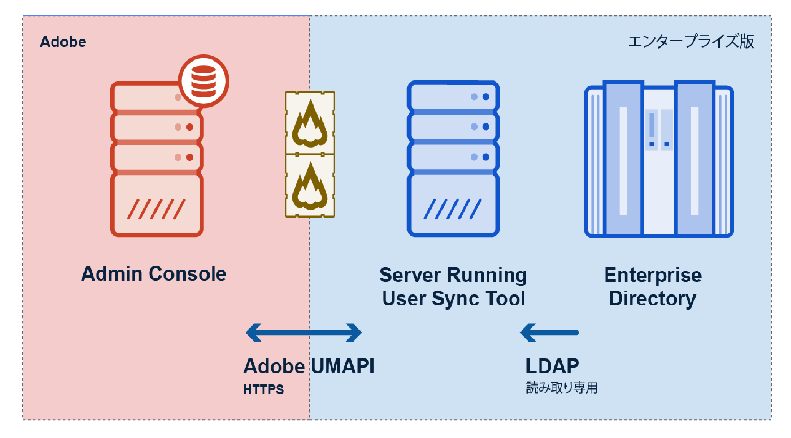

バージョン 2.1.1、2017 年 6 月 9 日公開

このドキュメントには、User Sync をインストールおよび導入するために必要なすべての情報が含まれています。ユーザーがローカルオペレーティングシステムのコマンドラインツールの使用に精通していること、またエンタープライズディレクトリシステムの操作について一般的な理解を有していることを前提としています。

# 概要

## このセクションの内容
{:."no_toc"}

* TOC Placeholder
{:toc}

---

[次のセクション](setup_and_installation.md)

---

アドビが提供する User Sync は、ユーザー組織の LDAP 互換エンタープライズディレクトリシステム（Active Directory など）から、ユーザーおよびグループの情報をアドビのユーザー管理システムに移動するコマンドラインツールです。

User Sync を実行するたびに 2 つのシステムの差異が検出され、ユーザー組織のディレクトリと一致するようアドビのディレクトリがアップデートされます。

## 前提条件

User Sync は、ユーザーの企業が運用しているサーバー（Python 2.7.9 以降がインストールされている必要がある）からコマンドラインまたはスクリプトで実行します。サーバーはインターネットに接続され、アドビのユーザー管理システムとユーザーのエンタープライズディレクトリシステムにアクセスできる必要があります。

User Sync ツールは、ユーザー管理 API（UMAPI）のクライアントです。使用するには、[Adobe I/O コンソール](https://www.adobe.io/console/)で API クライアントとしてまず登録し、以下のとおりにインストールおよび構成します。

ツールの操作は、様々な構成をサポートするローカル構成ファイルおよびコマンド呼び出しパラメーターによって制御されます。例えば、どのユーザーを同期するか、ディレクトリグループをどのようにアドビグループや製品構成にマップするか、その他のオプションを制御できます。

このツールでは、ユーザーの企業がアドビ製品ライセンスを購入していることを前提としています。ユーザーグループおよび製品構成を定義するには、[Adobe Admin Console](https://adminconsole.adobe.com/enterprise/) を使用する必要があります。これらのグループのメンバーシップにより、組織内のどのユーザーがどの製品にアクセスできるかを制御します。

## 操作の概要

User Sync は、LDAP プロトコル経由でエンタープライズディレクトリと通信します。また、アドビのユーザー管理 API（UMAPI）経由で Adobe Admin Console と通信して、ユーザーの組織のユーザーアカウントデータをアップデートします。次の図は、システム間のデータの流れを示しています。

ツールを実行するたびに、次がおこなわれます。

- User Sync は、LDAP を通じてエンタープライズディレクトリシステムから従業員レコードを要求します。
- User Sync は、ユーザー管理 API を通じて Adobe Admin Console から現在のユーザーおよび関連する製品構成を要求します。
- User Sync は、User Sync 構成ファイルで定義した規則に基づいて、作成する、取り除く、またはアップデートするユーザーを特定し、そのユーザーのユーザーグループと製品構成メンバーシップを判断します。
- User Sync は、ユーザー管理 API を通じて Adobe Admin Console に対して必要な変更をおこないます。

## 使用モデル

User Sync ツールは、様々な方法でビジネスモデルに組み込むことができ、どの従業員や関係者がアドビ製品にアクセスできるかを追跡し制御するプロセスを自動化するのに役立ちます。

通常、企業はこのツールをスケジュール設定されたタスクとして実行し、アドビのユーザー管理システムにあるユーザー情報とグループメンバーシップの両方を定期的にアップデートします。最新の情報は企業の LDAP ディレクトリにあります。

このツールでは、他の様々なワークフローのオプションも提供されています。例えば、ユーザー情報だけをアップデートするよう選択し、製品アクセスに関するグループメンバーシップは Adobe Admin Console で直接処理することができます。すべてのユーザーをアップデートするか、ユーザー全体の特定のサブセットのみをアップデートするかも選択できます。加えて、情報を追加および更新するタスクと、ユーザーまたはメンバーシップを取り除くタスクを区別することができます。取り除くタスクを処理するための様々なオプションがあります。

使用モデルとその実装方法について詳しくは、後述の「[使用シナリオ](usage_scenarios.md#使用シナリオ)」セクションを参照してください。

---

[次のセクション](setup_and_installation.md)
