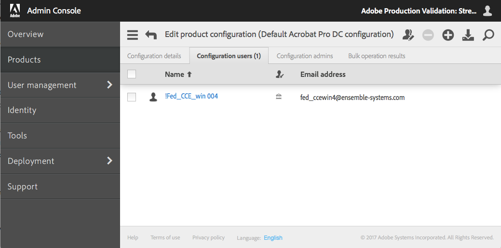

# よくある作業例

## このセクションの内容
{:."no_toc"}

* TOC Placeholder
{:toc}

---

[前のセクション](command_parameters.md)  \| [次のセクション](advanced_configuration.md)

---

User Sync ツールをエンタープライズプロセスに統合するには、次を含む様々な方法があります。

* **ユーザーとグループのメンバーシップをアップデートする。**アドビのユーザー管理システムでユーザーを追加、アップデート、および取り除いて、ユーザーやグループのメンバーシップを同期します。これは最も一般的な使用例です。
* **ユーザー情報のみを同期する。**Admin Console を使用して製品へのアクセスを処理する場合に、このアプローチを採用します。
* **同期するユーザーをフィルターする。**ユーザー情報の同期を特定のグループのユーザーに限定するか、特定のパターンに一致するユーザーのみに限定することができます。また、ディレクトリシステムではなく、CSVファイルに対して同期することもできます。
* **ユーザーおよびグループのメンバーシップをアップデートするが、取り除く操作は個別に処理する。**ユーザーの追加およびアップデートによってユーザーやグループのメンバーシップを同期しますが、最初の呼び出しではユーザーを取り除きません。代わりに、取り除くユーザーのリストを保持し、別の呼び出しで取り除く操作を実行します。

このセクションでは、これらの各シナリオの手順を説明します。

## ユーザーとグループのメンバーシップのアップデート

これは、最も一般的なタイプの呼び出しです。User Sync はエンタープライズ側で、ユーザーの情報およびグループメンバーシップの情報に対するすべての変更を見つけます。そしてユーザー、ユーザーグループ、製品プロファイルメンバーシップを追加、アップデート、および取り除いてアドビ側を同期します。

デフォルトでは、ID タイプが Enterprise ID または Federated ID のユーザーのみ作成される、取り除かれる、または User Sync によってグループメンバーシップが管理されます。なぜなら、一般に Adobe ID ユーザーはディレクトリ内で管理されないからです。ユーザーの組織がこのような仕組みになっている場合は、「[詳細な構成](advanced_configuration.md#詳細な構成)
」の[後述の説明](advanced_configuration.md#adobe-id-によるユーザーの管理)を参照してください。

この例では、構成ファイル user-sync-config.yml に、ディレクトリグループから **Default Acrobat Pro DC configuration** という名前のアドビ製品構成へのマッピングが含まれることを前提とします。

### コマンド

この呼び出しでは、ユーザーとプロセスグループの両方のパラメーターを提供し、`adobe-only-user-action remove` パラメーターでユーザーを取り除く操作を可能にします。

```sh
./user-sync –c user-sync-config.yml --users all --process-groups --adobe-only-user-action remove
```

### 操作中のログの出力

```text
2017-01-20 16:51:02 6840 INFO main - ========== Start Run ==========
2017-01-20 16:51:04 6840 INFO processor - ---------- Start Load from Directory -----------------------
2017-01-20 16:51:04 6840 INFO connector.ldap - Loading users...
2017-01-20 16:51:04 6840 INFO connector.ldap - Total users loaded: 4
2017-01-20 16:51:04 6840 INFO processor - ---------- End Load from Directory (Total time: 0:00:00) ---
2017-01-20 16:51:04 6840 INFO processor - ---------- Start Sync Dashboard ----------------------------
2017-01-20 16:51:05 6840 INFO processor - Adding user with user key: fed_ccewin4@ensemble-systems.com 2017-01-20 16:51:05 6840 INFO dashboard.owning.action - Added action: {"do": \[{"createFederatedID": {"lastname": "004", "country": "CA", "email": "fed_ccewin4@ensemble-systems.com", "firstname": "!Fed_CCE_win", "option": "ignoreIfAlreadyExists"}}, {"add": {"product": \["default acrobat pro dc configuration"\]}}\], "requestID": "action_5", "user": "fed_ccewin4@ensemble-systems.com"}
2017-01-20 16:51:05 6840 INFO processor - Syncing trustee org1... /v2/usermanagement/action/82C654BDB41957F64243BA308@AdobeOrg HTTP/1.1" 200 77
2017-01-20 16:51:07 6840 INFO processor - ---------- End Sync Dashboard (Total time: 0:00:03) --------
2017-01-20 16:51:07 6840 INFO main - ========== End Run (Total time: 0:00:05) ==========
```

### 結果の表示

同期が完了すると、Adobe Admin Console がアップデートされます。このコマンドが実行されると、Admin Console にあるユーザーリストと製品構成ユーザーリストでは、Federated ID を持つユーザーが「Default Acrobat Pro DC configuration.」に追加されたことを示しています。



### ユーザーのみの同期

コマンドに `users` パラメーターのみを指定すると、アクションはエンタープライズディレクトリ内のユーザー情報の変更を見つけて、それらの変更についてアドビ側をアップデートします。エンタープライズ側でどのユーザーを探すかを制御する `users` パラメーターを引数に指定することもできます。

この呼び出しでは、グループメンバーシップの変更を探したりアップデートしたりしません。この方法でツールを使用する場合は、Adobe Admin Console でユーザーグループおよび製品プロファイルのメンバーシップをアップデートすることによってアドビ製品へのアクセスを制御することが期待されます。

また、アドビ側にはあるもののディレクトリ側にはないユーザーを無視し、製品プロファイルやユーザーグループ管理も実行されません。

```sh
./user-sync –c user-sync-config.yml --users all
```

### 同期するユーザーのフィルター

グループメンバーシップ情報を同期するかしないかに関係なく、エンタープライズディレクトリ側で対象となるユーザーをフィルターするユーザーパラメーター、またはユーザー情報をエンタープライズ LDAP ディレクトリから直接取得するのではなく CSV ファイルから取得するユーザーパラメーターに引数を指定することができます。

### 特定グループ内のユーザーのみ同期

このアクションは、指定されたグループ内にあるユーザーのユーザー情報に対する変更を探します。エンタープライズディレクトリ内の他のユーザーは探さず、製品プロファイルやユーザーグループ管理は実行しません。

```sh
./user-sync –c user-sync-config.yml --users groups "group1, group2, group3"
```

### マッピングされたグループ内のユーザーのみ同期

このアクションは、`--users groups "..."` を指定するのと同じで、`...` は構成ファイル内のグループマッピングにあるすべてのグループです。

```sh
./user-sync –c user-sync-config.yml --users mapped
```

### 一致するユーザーのみの同期

このアクションは、ユーザー ID がパターンに一致するユーザーのユーザー情報に対する変更のみを探します。パターンは Python 正規表現によって指定します。この例では、グループメンバーシップもアップデートされます。

```sh
user-sync --users all --user-filter 'bill@forxampl.com' --process-groups
user-sync --users all --user-filter 'b.*@forxampl.com' --process-groups
```

### ファイルからの同期

このアクションは、エンタープライズディレクトリを参照するのではなく、CSV ファイルから提供されるユーザー情報に同期します。`examples/csv inputs - user and remove lists/` にあるサンプルの構成ファイルのダウンロードには、そのようなファイルの例として users-file.csv が提供されています。

```sh
./user-sync --users file user_list.csv
```

ファイルからの同期は、2 つの状況で使用できます。まず、スプレッドシートを使用してアドビユーザーを管理できます。スプレッドシートには、ユーザー、ユーザーが所属するグループ、およびユーザーの情報がリストされています。次に、エンタープライズディレクトリでアップデートに関するプッシュ通知を提供できる場合、それらの通知を csv ファイルに配置して、User Sync のアップデートを実施するために使用できます。この使用シナリオについて詳しくは、後述のセクションを参照してください。

### ユーザーおよびグループのメンバーシップをアップデートするが、取り除く操作は個別に処理する

`--adobe-only-user-action` パラメーターを指定しない場合、アドビ側ではユーザーを取り除かずに、ユーザーおよびグループのメンバーシップを同期できます。

取り除く操作を個別に処理する場合、アドビ側には存在するもののエンタープライズディレクトリにはもはや存在しないユーザーをフラグするようツールに指示できます。`--adobe-only-user-action write-file exiting-users.csv` パラメーターは、取り除くようフラグされたユーザーのリストを CSV ファイルに出力します。

別の呼び出しで取り除く操作を実行するには、`--adobe-only-user-action write-file` パラメーターによって生成されたファイルを渡すか、他の方法で生成したユーザー CSV ファイルを渡すことができます。`csv inputs - user and remove lists` フォルダーにある example-configurations.tar.gz ファイルには、そのようなファイルの例として `remove-list.csv` が提供されています。

#### ユーザーを追加して、取り除くユーザーのリストを生成する

このアクションは、すべてのユーザーを同期し、ディレクトリにはもはや存在しないもののアドビ側にはまだ存在するユーザーのリストを生成します。

```sh
./user-sync --users all --adobe-only-user-action write-file users-to-remove.csv
```

#### 別のリストからユーザーを取り除く

このアクションは、取り除くためにフラグされているユーザーのリストを含む CSV ファイルを参照し、アドビ側で組織からこれらのユーザーを取り除きます。CSV ファイルは通常、`--adobe-only-user-action write-file` パラメーターを使用した以前の呼び出しで生成されたものです。

他の方法でも、取り除くユーザーの CSV ファイルを作成することができます。ただし、ディレクトリにまだ存在するユーザーがリストに含まれている場合、それらのユーザーは、ユーザーを追加する次の同期アクションでアドビ側にまた追加されます。

```sh
./user-sync --adobe-only-user-list users-to-remove.csv --adobe-only-user-action remove
```

### アドビ側には存在するがディレクトリには存在しないユーザーを削除する

この呼び出しでは、ユーザーとプロセスグループの両方のパラメーターを提供し、adobe-only-user-action の削除パラメーターでユーザーアカウントの削除を可能にします。

```sh
./user-sync --users all --process-groups --adobe-only-user-action delete
```

### 別のリストからユーザーを削除する

ユーザーを取り除く上記の例と同様に、User Sync の以前の実行時に生成されたリストに基づいて、これもアドビ側にしか存在しないユーザーを削除します。

```sh
./user-sync --adobe-only-user-list users-to-delete.csv --adobe-only-user-action delete
```

## プッシュ通知の処理

ご使用のディレクトリシステムでアップデートの通知を生成できる場合は、User Sync を使ってこれらの更新を段階的に処理することができます。このセクションに示されている方法は、管理者がユーザーまたはユーザーグループをアップデートし、そのアップデートのみをすぐにアドビのユーザー管理システムにプッシュしたい場合のように、すぐにアップデートを処理するためにも使用できます。プッシュ通知から来る情報を User Sync への入力に適した csv 形式に変換するため、および User Sync では個別に処理する必要のある他のアップデートから削除を分離するために、ある程度のスクリプティングが必要になる可能性があります。

例として `updated_users.csv` というファイルを作成し、ユーザーアップデート形式は `csv inputs - user and remove lists` フォルダーの `users-file.csv` サンプルファイルに示します。これは基本的な csv ファイルで、firstname、lastname などの列が含まれています。

    firstname,lastname,email,country,groups,type,username,domain
    John,Smith,jsmith@example.com,US,"AdobeCC-All",enterpriseID
    Jane,Doe,jdoe@example.com,US,"AdobeCC-All",federatedID
 
次に、このファイルが User Sync に提供されます。

```sh
./user-sync --users file updated-users.csv --process-groups --update-users --adobe-only-user-action exclude
```

--adobe-only-user-action exclude は、User Sync が updated-users.csv にあるユーザーのみをアップデートし、他のすべてのユーザーは無視されます。

削除も同様に処理されます。同じサンプルフォルダーにある `remove-list.csv` の形式に基づいて `deleted-users.csv` ファイルを作成し、User Sync を実行します。

```sh
./user-sync --adobe-only-user-list deleted-users.csv --adobe-only-user-action remove
```

これにより通知に基づいて削除が処理され、他のアクションは取られません。なお、削除されたユーザーの処理に応じて、`remove` を他のアクションに置き換えることもできます。

## アクションの概要

呼び出しの最後に、アクションの概要が印刷されます(レベルが INFO か DEBUG の場合）。
概要は実行時に累計された統計情報を提供します。
収集される統計情報には次が含まれます。

- **Total number of Adobe users:** Admin Console 内のアドビユーザーの合計数
- **Number of Adobe users excluded:** exclude_parameters によって操作から除外されたアドビのユーザー数
- **Total number of directory users:** LDAP または CSV ファイルから読み取られたユーザーの合計数
- **Number of directory users selected:** user-filter パラメーターによって選択されたディレクトリユーザーの数
- **Number of Adobe users created:** この実行の最中に作成されたアドビユーザーの数
- **Number of Adobe users updated:** この実行の最中にアップデートされたアドビユーザーの数
- **Number of Adobe users removed:** アドビ側で組織から取り除かれたアドビユーザーの数
- **Number of Adobe users deleted:** アドビ側で組織から取り除かれたアドビユーザーの数、および削除された Enterprise/Federated ユーザーアカウントの数
- **Number of Adobe users with updated groups:** 1 つまたは複数のユーザーグループに追加されたアドビユーザーの数
- **Number of Adobe users removed from mapped groups:** 1 つまたは複数のユーザーグループから取り除かれたアドビユーザーの数
- **Number of Adobe users with no changes:** この実行時に変更がなかったアドビユーザーの数

### アクションの概要のログへの出力例
```text
2017-03-22 21:37:44 21787 INFO processor - ------------- Action Summary -------------
2017-03-22 21:37:44 21787 INFO processor -   Total number of Adobe users: 50
2017-03-22 21:37:44 21787 INFO processor -   Number of Adobe users excluded: 0
2017-03-22 21:37:44 21787 INFO processor -   Total number of directory users: 10
2017-03-22 21:37:44 21787 INFO processor -   Number of directory users selected: 10
2017-03-22 21:37:44 21787 INFO processor -   Number of Adobe users created: 7
2017-03-22 21:37:44 21787 INFO processor -   Number of Adobe users updated: 1
2017-03-22 21:37:44 21787 INFO processor -   Number of Adobe users removed: 1
2017-03-22 21:37:44 21787 INFO processor -   Number of Adobe users deleted: 0
2017-03-22 21:37:44 21787 INFO processor -   Number of Adobe users with updated groups: 2
2017-03-22 21:37:44 21787 INFO processor -   Number of Adobe users removed from mapped groups: 5
2017-03-22 21:37:44 21787 INFO processor -   Number of Adobe users with no changes: 48
2017-03-22 21:37:44 21787 INFO processor - ------------------------------------------
```

---

[前のセクション](command_parameters.md)  \| [次のセクション](advanced_configuration.md)

